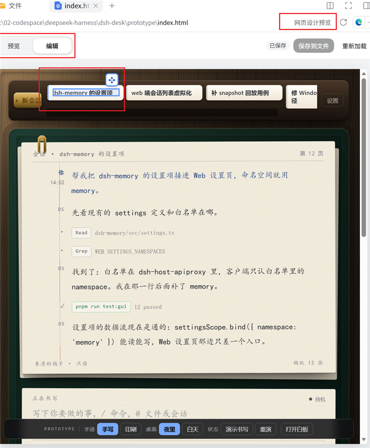
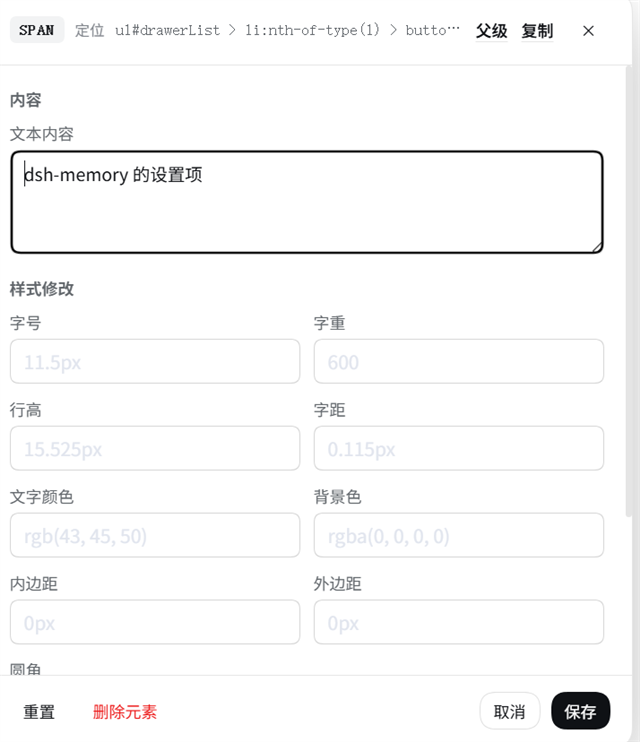

# dsh-web-design

[English](README.md) | 中文

## 背景：DeepSeek Harness

DeepSeek Harness（`dsh`）是 DeepSeek AI 开源的 agent harness，几乎所有能力都是 [Cordis](https://github.com/cordiverse/cordis) 插件。它处于 **developer preview** 阶段、迭代很快，会有破坏性变更（[文档站](https://deepseek-harness.github.io/deepseek-harness/)，`0.1.7-alpha.*`）；本插件是独立第三方包，`@deepseek-ai/*` 运行时从宿主解析。

## 这个插件解决什么问题

原本没法在 DSH 里看着渲染结果改页面；本插件在侧栏预览 `.html`，可改样式、文字、位置与删除，并把改动写回源文件。

## 截图


侧栏预览一个已打开的 `.html` 文件，工具栏里是 **预览 / 编辑** 切换与 **保存到文件**。


元素编辑弹窗：所选元素的选择器、它的文本，以及可以写回文件的样式字段。

## 安装

```sh
npx @deepseek-ai/dsh plugin --profile web add @guowenzhang/dsh-web-design
```

来自 npm 官方源：<https://www.npmjs.com/package/@guowenzhang/dsh-web-design>。装完重启宿主；本地目录开发安装、git 源与排查见 [AGENTS.md](AGENTS.md)。

## 用法

### 在侧栏打开 HTML 文件

在侧栏里打开 `.html` 或 `.htm` 文件，会以渲染后的页面代替静态源码视图，文件自己的内联 CSS 与脚本照常运行。

### 在预览与编辑之间切换

工具栏上的两挡开关在 **Preview** 与 **Edit** 之间切换，页面不重新挂载。**Preview** 保留页面按钮、链接等点击行为，页面可以正常使用。**Edit** 下单击选中元素、双击打开浮动编辑弹窗，页面本身不被替换。每次切换都要等页面确认后才接受下一次点击，所以连点不会让页面在错误的模式下被激活。

### 编辑元素

切到 **Edit**，单击要改的元素高亮它，再双击打开弹窗。对于覆盖在文字上的透明控件，点文字选中的是文字叶子节点，点控件周围选中的是它的框。弹窗里的 **Parent** 动作向上选择容纳它的元素，包括边框太细、没法直接点中的分组。空间够时弹窗开在预览旁边，视口窄时贴在底部。一有草稿，工具栏立刻显示 **Unsaved**；**Cancel** 丢弃它。

### 移动元素

拖动选中框上的手柄。块级元素用 CSS `translate` 移动；行内文字元素用相对 `left`/`top` 偏移，因为浏览器不会平移普通的行内盒。弹窗里 **Save** 保留新位置，**Cancel** 恢复原来的行内声明。

### 编辑样式

弹窗可以改字号、字重、行高、字距、文字颜色、背景色、内边距、外边距与圆角。保存后的覆盖样式立即作用于预览框，并随这次评审一起留存。

### 编辑文本

恰好有一个非空直属文字节点的元素，会在输入框里暴露这段文字，即使它同时还有子元素。父容器不能替换后代的文字，也无法在多个直属文字段之间猜。弹窗标题栏标出所选标签与 CSS 选择器，右侧是紧凑的 **Parent** 与 **Copy**。**Copy** 把所选元素的 CSS 选择器放进剪贴板，便于把精确改动转给别人，元素没有可编辑直属文字时也能用。弹窗里 **Save** 改变预览框，并把文本替换留作待写入文件的改动。

### 删除元素

**Delete element** 把所选元素及其后代移出预览。在 **Save to file** 从 HTML 源码里删掉那个确切的元素之前，工具栏一直显示 **Unsaved**。**Undo deletion** 恢复所有还没写进文件的删除。文档根元素（`html`、`head`、`body`）不能删除。

### 写回文件

**Save to file** 把样式、文本与删除改动写进 HTML 文件本身。在那之前，这些改动存在产物旁边的评审文件里，加载时重新应用；预览自己从不写 HTML。

- **Applied** —— 选择器在文件里定位到了。
- **Skipped** —— 选择器无法在源码里唯一定位（例如元素由脚本生成、id 重复，或同级路径变得有歧义）。预览会如实报告，而不是谎报成功。

文本替换只支持只有一个非空直属文字节点的元素；子标记保留，多个直属文字段一律拒绝。写文件成功后，那次已提交的改动会清掉 **Unsaved** 状态。

## 注意事项

- **相对路径的页面资源不会被打进这个预览。** 内联 CSS 与脚本的 HTML 直接渲染；指向同目录 CSS、JavaScript、图片或字体的链接，需要另有一条资源加载通路才能出现在这个隔离框里。
- **Save to file 够不到只在页面脚本运行后才存在的元素。** 选择器是在源码树上解析的，所以页面 JavaScript 创建的元素会被报成 skipped，而不会被写到别处。
- **脚本可以把本来完全相同的同级元素换位。** 同级数量不变时，单靠一条选择器路径无法证明被移动的 DOM 节点来自哪个作者写的同级元素。要写回文件的元素请用稳定的 id；否则保存后自己看一眼文件。
- **改动以源文本 span 改写落地，不重新序列化 DOM。** 文件保留自己的注释、格式与原有结构，只替换改动定位到的那几段。
- **文件里其余的字节逐字保留。** 样式或文本改动只替换定位到的那个属性或文字节点，删除只移除该元素完整的源 span（含子节点）。

## 许可

插件本体是 Apache-2.0——见 [LICENSE](LICENSE) 与 [NOTICE](NOTICE)。它不含任何 DeepSeek Harness 源码：harness 包是从运行中的宿主解析的 peer 依赖。

它的两个运行时依赖各自保留自己的许可：`parse5` 是 MIT，`@deepseek-ai/dsh-atomic-write` 是 MIT。

## 延伸阅读

- [AGENTS.md](AGENTS.md) —— 安装变体、构建、组合与部署生效语义、发版、技术决策、测试与排查。
- [dsh-ui-beautify](https://github.com/zhang-guo-wen/dsh-ui-beautify) —— 姊妹插件，挑选 harness 的正文与代码字体。
- [DeepSeek Harness 文档](https://deepseek-harness.github.io/deepseek-harness/)。
