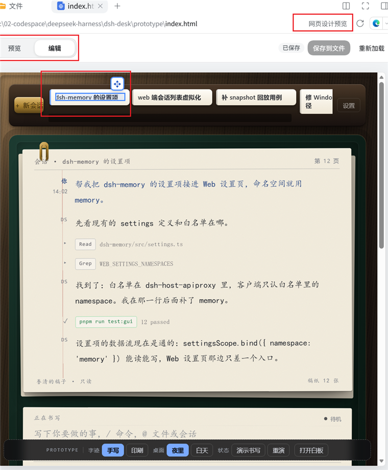
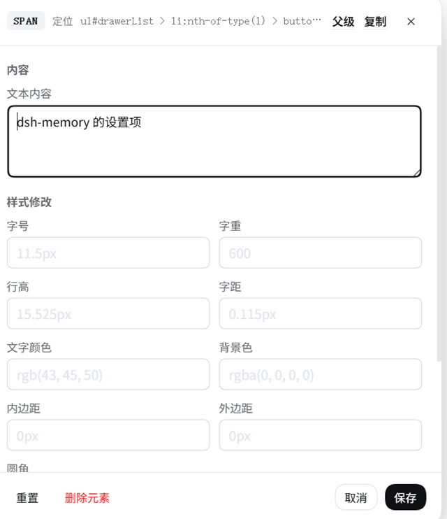

# dsh-web-design

[English](README.md) | 中文

## 解决什么问题

AI 生成原型页面时，经常自作主张地添加一些描述和区块，想删掉它们却要反复与 AI 沟通。

这个 DeepSeek Harness 插件让你直接在 HTML 预览中删除区块、修改文字，也能调整样式和位置，最后将改动保存到 HTML 文件，无需让 AI 代改。

## 截图





## 安装

```sh
npx @deepseek-ai/dsh plugin --profile web add @guowenzhang/dsh-web-design
```

安装后重启 DSH。在侧栏打开 `.html` 或 `.htm` 文件，切换到「编辑」，单击选中元素、双击打开编辑弹窗，修改后点击「保存到文件」。

## 注意事项

- 只有点击「保存到文件」才会修改 HTML 源文件；预览中的修改会暂存在同目录的 `<文件名>.design.json` 中。
- 修改文字时，请选中具体的文字元素；包含多个直属文字段的元素不支持直接替换。
- 脚本动态生成或无法在源码中唯一定位的元素会跳过保存。建议为需要编辑的元素设置唯一且稳定的 `id`，保存后检查结果。
- 相对路径引用的 CSS、JavaScript、图片和字体可能无法在预览中加载；建议使用内联样式和脚本的单文件原型。

## 许可

[Apache-2.0](LICENSE)，另见 [NOTICE](NOTICE)。运行时依赖 `parse5` 与 `@deepseek-ai/dsh-atomic-write` 均采用 MIT 许可。
